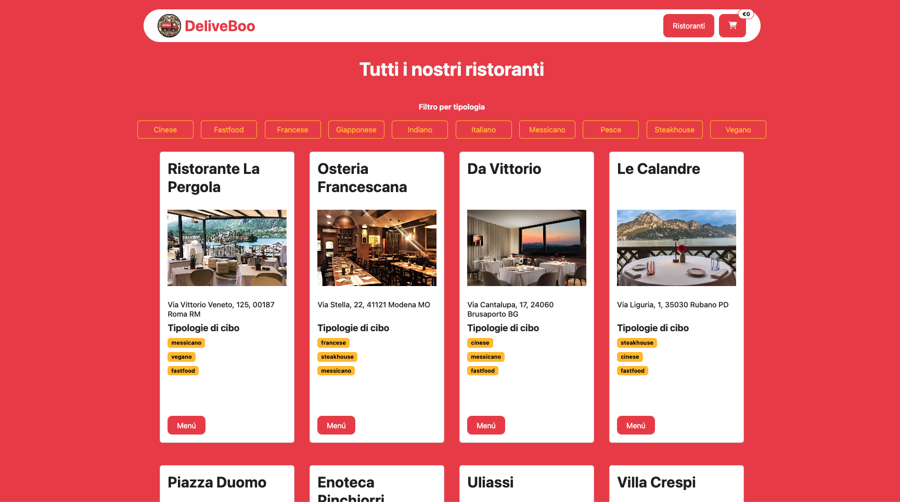
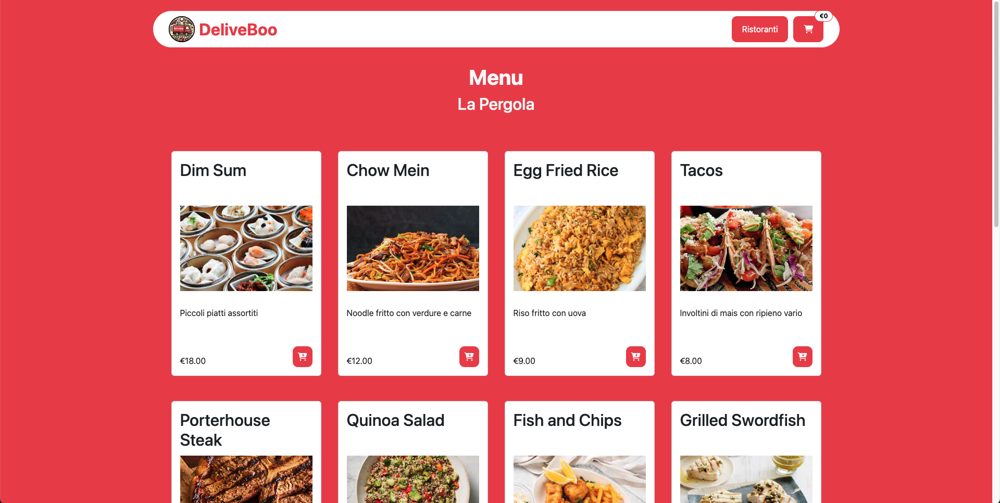
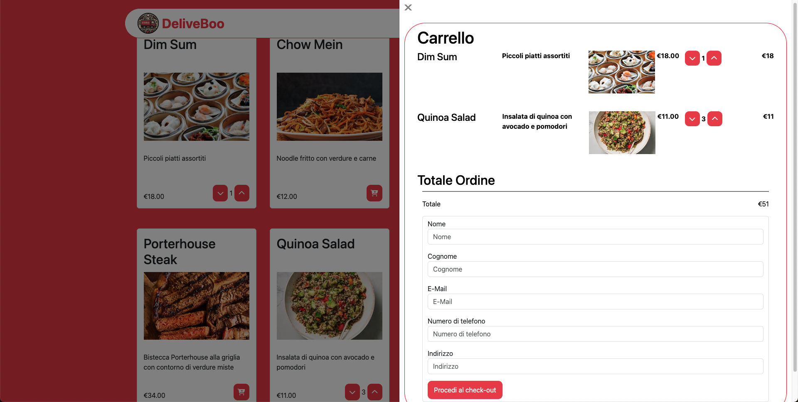

***Progetto finale Deliveboo***

Front-end per clienti

Creazione di una home page, di una pagina con i ristoranti e i loro menù con i relativi piatti con possibilità di effettuare l'ordine dal carrello e successivo pagamento.

Questo repository è la parte di front-end di un progetto che comprende anche il back-end:

https://github.com/AlessiaCiabatti/Deliveboo-Backend.git

